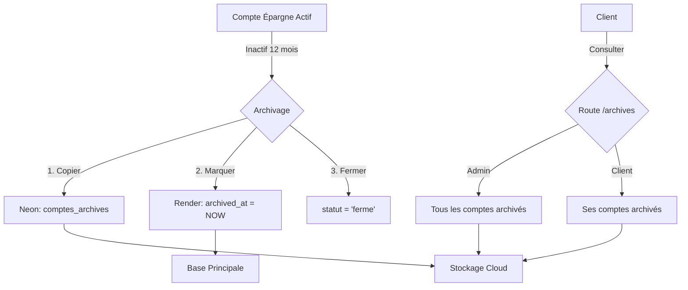

# 📦 Système d'archivage Cloud (Neon)

## 📋 Vue d'ensemble

Le système d'archivage permet de transférer les **comptes épargne inactifs** vers une base de données cloud PostgreSQL (Neon) pour un stockage long terme, tout en maintenant un accès rapide aux données archivées.

---

## 🏗️ Architecture

### **Bases de données**

1. **Base principale (Render PostgreSQL)** 
   - Stocke les comptes actifs
   - Table: `comptes`
   - Colonne: `archived_at` (nullable) - Date d'archivage
   - Colonne: `cloud_storage_path` (nullable) - Chemin dans le cloud

2. **Base cloud (Neon PostgreSQL)** 
   - Stocke les comptes archivés
   - Table: `comptes_archives`
   - Configuration: `connection = 'neon'`
   - SSL requis pour la connexion

---

## 🔧 Configuration

### **1. Variables d'environnement (.env)**

```env
# Neon Cloud Database (pour archives)
NEON_DB_HOST=your-project.neon.tech
NEON_DB_PORT=5432
NEON_DB_DATABASE=neondb
NEON_DB_USERNAME=your-username
NEON_DB_PASSWORD=your-password
```

### **2. Configuration de la connexion (config/database.php)**

```php
'neon' => [
    'driver' => 'pgsql',
    'host' => env('NEON_DB_HOST'),
    'port' => env('NEON_DB_PORT', 5432),
    'database' => env('NEON_DB_DATABASE'),
    'username' => env('NEON_DB_USERNAME'),
    'password' => env('NEON_DB_PASSWORD'),
    'charset' => 'utf8',
    'prefix' => '',
    'prefix_indexes' => true,
    'schema' => 'public',
    'sslmode' => 'require', // ⚠️ Important pour Neon
],
```

### **3. Migrations**

Exécuter les migrations pour créer les structures nécessaires:

```bash
# Migration pour ajouter archived_at à la table comptes (base principale)
php artisan migrate

# Migration pour créer comptes_archives dans Neon
php artisan migrate --database=neon
```

---

## 📊 Structure des données

### **Table: comptes (base principale)**

```sql
-- Nouvelles colonnes ajoutées:
archived_at TIMESTAMP NULL
cloud_storage_path VARCHAR(255) NULL
```

### **Table: comptes_archives (Neon)**

```sql
CREATE TABLE comptes_archives (
    id UUID PRIMARY KEY,
    numeroCompte VARCHAR(255) NOT NULL,
    client_id UUID NOT NULL,
    type VARCHAR(50) NOT NULL,
    solde DECIMAL(15, 2) DEFAULT 0,
    devise VARCHAR(3) DEFAULT 'XOF',
    statut VARCHAR(50) NOT NULL,
    
    -- Données d'archivage
    archived_at TIMESTAMP NOT NULL,
    archived_by UUID NOT NULL,
    archive_reason TEXT,
    
    -- Données client dénormalisées (pour requêtes rapides)
    client_nom VARCHAR(255),
    client_email VARCHAR(255),
    client_telephone VARCHAR(20),
    
    -- Timestamps
    created_at TIMESTAMP,
    updated_at TIMESTAMP,
    
    -- Index
    INDEX idx_client_id (client_id),
    INDEX idx_type (type),
    INDEX idx_archived_at (archived_at)
);
```

---

## 🚀 Utilisation

### **1. Archiver un compte (Admin uniquement)**

**Endpoint:** `POST /api/v1/comptes/{numeroCompte}/archive`

**Requête:**
```bash
curl -X POST "http://localhost:8000/api/v1/comptes/CE1234567890/archive" \
  -H "Accept: application/json" \
  -H "Cookie: access_token=YOUR_TOKEN" \
  -H "Content-Type: application/json" \
  -d '{
    "reason": "Inactif depuis 12 mois"
  }'
```

**Réponse:**
```json
{
  "status": "success",
  "message": "Compte archivé avec succès dans le cloud",
  "data": {
    "numeroCompte": "CE1234567890",
    "archived_at": "2025-01-26T19:30:00.000000Z",
    "archive_reason": "Inactif depuis 12 mois"
  }
}
```

**Ce qui se passe:**
1. ✅ Vérifie que le compte existe
2. ✅ Vérifie que c'est un compte épargne (type='epargne')
3. ✅ Copie les données vers Neon (table `comptes_archives`)
4. ✅ Met à jour `archived_at` et `cloud_storage_path` dans la base principale
5. ✅ Ferme le compte (statut='ferme')
6. ✅ Log l'opération

---

### **2. Lister les comptes archivés**

**Endpoint:** `GET /api/v1/comptes/archives`

**Requête:**
```bash
curl -X GET "http://localhost:8000/api/v1/comptes/archives" \
  -H "Accept: application/json" \
  -H "Cookie: access_token=YOUR_TOKEN"
```

**Réponse (Admin):**
```json
{
  "status": "success",
  "message": "Liste de tous les comptes archivés récupérée avec succès",
  "data": [
    {
      "id": "uuid-1",
      "numeroCompte": "CE1234567890",
      "type": "epargne",
      "solde": 50000.00,
      "client_nom": "Fatou Diop",
      "client_telephone": "+221771234567",
      "archived_at": "2025-01-26T19:30:00Z",
      "archive_reason": "Inactif depuis 12 mois"
    }
  ]
}
```

**Réponse (Client):**
```json
{
  "status": "success",
  "message": "Vos comptes archivés récupérés avec succès",
  "data": [
    {
      "id": "uuid-1",
      "numeroCompte": "CE1234567890",
      "type": "epargne",
      "solde": 50000.00,
      "archived_at": "2025-01-26T19:30:00Z",
      "archive_reason": "Inactif depuis 12 mois"
    }
  ]
}
```

---

### **3. Archivage automatique (commande Artisan)**

Créer une commande pour archiver automatiquement les comptes inactifs:

```php
// app/Console/Commands/ArchiveInactiveComptes.php
php artisan make:command ArchiveInactiveComptes

// Dans la commande:
$count = $this->archiveService->archiveInactiveComptes(12, $adminUser);
$this->info("$count comptes archivés avec succès");
```

**Scheduler (app/Console/Kernel.php):**
```php
protected function schedule(Schedule $schedule)
{
    // Archiver les comptes inactifs chaque mois
    $schedule->command('comptes:archive-inactive 12')
        ->monthly()
        ->at('02:00');
}
```

---

## 🛡️ Sécurité et permissions

### **Qui peut archiver ?**
- ✅ **Administrateurs uniquement**
- ❌ Clients ne peuvent PAS archiver

### **Qui peut consulter les archives ?**
- ✅ **Administrateurs** : Voient tous les comptes archivés
- ✅ **Clients** : Voient uniquement leurs propres comptes archivés

### **Validation**
- Seuls les comptes **type='epargne'** peuvent être archivés
- Un compte déjà archivé ne peut pas être archivé à nouveau
- Les comptes supprimés (soft deleted) ne peuvent pas être archivés

---

## 📈 Performance

### **Optimisations**

1. **Index sur comptes_archives:**
   - `idx_client_id` : Requêtes par client
   - `idx_type` : Filtrage par type
   - `idx_archived_at` : Tri chronologique

2. **Données dénormalisées:**
   - `client_nom`, `client_email`, `client_telephone` stockés directement
   - Évite les JOINs coûteux sur les archives

3. **Connexion SSL:**
   - `sslmode=require` pour Neon
   - Chiffrement des données en transit

---

## 🧪 Tests

### **Tester la connexion Neon**

```bash
php artisan tinker
```

```php
// Tester la connexion
DB::connection('neon')->select('SELECT version()');

// Créer une archive test
$archive = new App\Models\CompteArchive([
    'numeroCompte' => 'TEST123',
    'type' => 'epargne',
    'archived_at' => now(),
]);
$archive->save();

// Récupérer les archives
App\Models\CompteArchive::all();
```

---

## 🔄 Workflow complet



---

## ⚠️ Points d'attention

1. **Migration Neon:**
   ```bash
   php artisan migrate --database=neon
   ```
   Exécuter cette commande APRÈS avoir configuré les variables NEON_* dans .env

2. **SSL requis:**
   Neon nécessite `sslmode=require`, ne pas oublier cette configuration

3. **Credentials Neon:**
   - Obtenir sur [console.neon.tech](https://console.neon.tech)
   - Créer un nouveau projet PostgreSQL
   - Copier les credentials de connexion

4. **Backup:**
   Neon gère automatiquement les backups, mais vérifier la politique de rétention

---

## 📚 Ressources

- **Neon Documentation:** https://neon.tech/docs
- **Laravel Multi-Database:** https://laravel.com/docs/10.x/database#configuration
- **Migration artisanale:** `database/migrations/2025_01_26_190000_create_comptes_archives_table_neon.php`

---

## 📝 Checklist post-implémentation

- [ ] Variables NEON_* configurées dans .env
- [ ] Migration exécutée: `php artisan migrate`
- [ ] Migration Neon exécutée: `php artisan migrate --database=neon`
- [ ] Connexion Neon testée via Tinker
- [ ] Route `/api/v1/comptes/archives` testée
- [ ] Route `/api/v1/comptes/{numero}/archive` testée
- [ ] Permissions admin vérifiées
- [ ] Documentation Swagger mise à jour
- [ ] Logs vérifiés (`storage/logs/laravel.log`)
- [ ] Commande d'archivage automatique créée (optionnel)
- [ ] Scheduler configuré (optionnel)

---

**✅ Système d'archivage opérationnel !**
